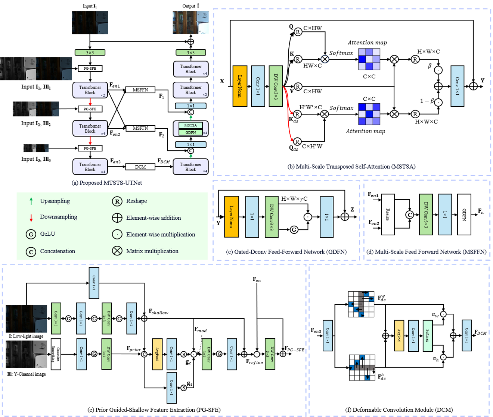
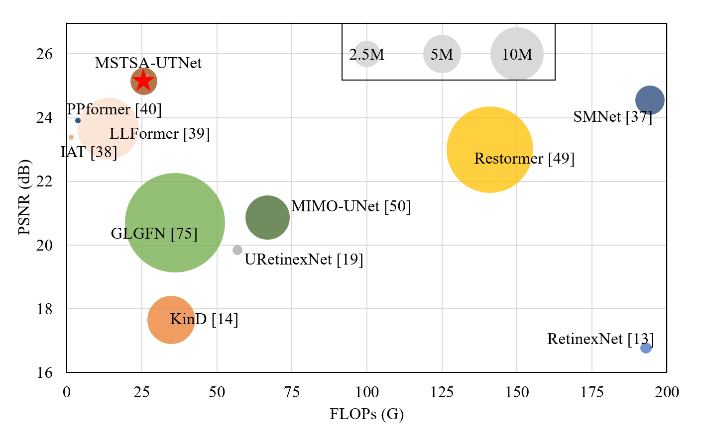
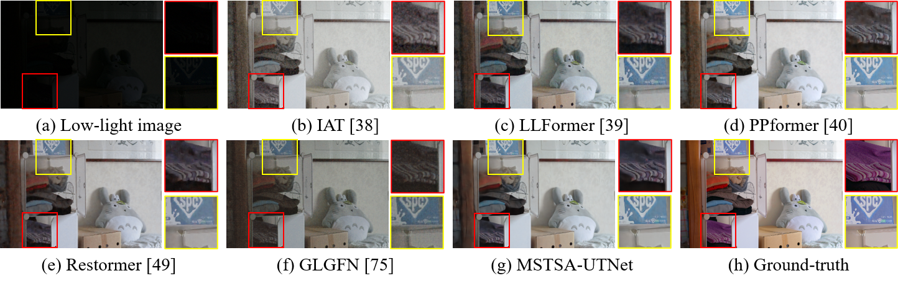
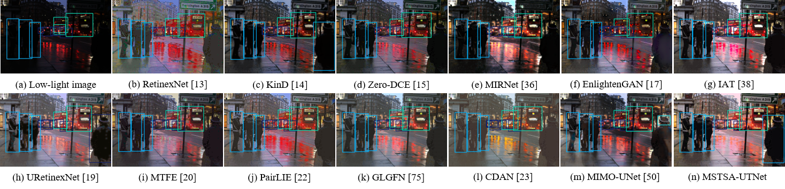

# [IVC 2026] [A Multi-Scale U-Shaped Transformer Neural Network for Low-Light Image Enhancement](https://www.sciencedirect.com/science/article/abs/pii/S0262885625003890)

## [Ji Soo Shin](https://github.com/tlswltn8883), Ho Sub Lee
[](https://www.sciencedirect.com/science/article/abs/pii/S0262885625003890)

<hr />

> **Abstract:** * Low-light image enhancement (LLIE) aims to improve the visibility and visual quality of images captured under insufficient lighting conditions, which are typically characterized by low contrast, suppressed textures, and amplified noise. Recent methods often employ a multi-scale enhancement strategy by stacking sub-networks—such as cascaded convolutional blocks or a single scale transposed self-attention module—to refine contrast from coarse to fine levels. However, these methods struggle to effectively restore natural color appearance and fail to preserve global illumination cues, which limits the generalization capability of the models. In addition, conventional self-attention methods for LLIE operate at a single resolution, making it difficult to effectively fuse multi-scale features and thus constraining their ability to simultaneously capture long-range dependencies and preserve fine structural details. To address these issues, this paper proposes MSTSA-UTNet, a compact U-shaped Transformer architecture that incorporates a newly designed Transformer block based on multi-scale transposed self-attention (MSTSA) with lightweight feed forward modules, and adopts a multi-scale input, single-scale output (MISO) strategy. The key idea of MSTSA is to enable multi-resolution interaction by simultaneously incorporating original high-resolution features and down-sampled low-resolution features. Furthermore, the proposed feature extraction and fusion framework comprises two core components: a prior-guided shallow feature extraction (PG-SFE) module that preserves low-level spatial cues while incorporating illumination priors to modulate shallow features, and a multi-scale feed forward network (MSFFN) that performs gated fusion to selectively integrate global context and local detail. This design facilitates improved feature learning for low-light enhancement. Extensive experimental results demonstrate that the proposed MSTSA-UTNet consistently outperforms recent state-of-the-art multi-scale enhancement method, SMNet [37], by up to 0.59 dB in PSNR on the LOL-v1 dataset. 
<hr />

## Network Architecture


## Requirements

- Python 3.9
- PyTorch 2.5
- CUDA 12.4

## Training and Evaluation
To train and evaluate MSTSA-UTNet, set the options in `train.py` or `test.py`, and run:
```
python train.py
python test.py
```

## Results
- **+0.59 dB PSNR** improvement over SMNet on the LOL-v1 dataset
- **20 FPS** inference speed
- **69.72 mAP@50** on the ExDark dataset

The PSNR-FLOPs-Params comparison on LOL-v1 dataset:


The quantitative comparison on LOL-v1 dataset:


The object detection comparison on ExDark dataset:


## Citation
If you find this work useful, please cite:

```bibtex
@article{shin2026mstsa,
  title={A Multi-Scale U-Shaped Transformer Neural Network for Low-Light Image Enhancement},
  author={Shin Ji Soo and Lee Ho Sub},
  journal={Image and Vision Computing},
  volume={166},
  pages={105801},
  year={2026},
  doi={10.1016/j.imavis.2025.105801}
}
```

**Acknowledgment:**
This code is based on the [RawFormer](https://github.com/xuwanyan1998/RawFomer).
